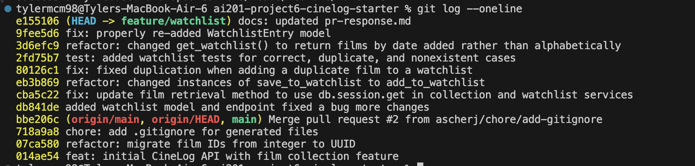

# PR Response Doc — CineLog Watchlist Feature

## AI Usage
AI was mostly used to navigate the git CLI commands. With so many options and my personal unfamiliarity with working with other people's repositories, I was able to get through this more quickly with the help of AI. During the rebase process, I had to go back a few steps, and it was able to walk me through aborting the rebase and going back to the start. 

## Comment 1 — Rename
**What I did:** Renamed function calls to save_to_watchlist() to add_to_watchlist() to follow project code conventions.
**How I verified:** Checked document-wide with Shift-F12 to search for all instances of save_to_watchlist() and renamed them. Checked again afterwards so that no other references were found.

## Comment 2 — Deduplication
**What I did:** Following the structure of add_to_collection() from services/collection_service.py, I added the block:
```existing = WatchlistEntry.query.filter_by(
        user_id=user_id, film_id=film_id
        ).first()
    if existing:
        raise AlreadyInWatchlistError(
            f"Film '{film_id}' is already in this user's watchlist"
        )
```
Again, following the same structure as the other services, I added the AlreadyInWatchlistError exception and modified the response so that it matched with the codebase conventions. 
**How I verified:** To maintain overall codebase integrity, the same structure as the other service's implementation was followed. To verify that the change worked, a test program: test_watchlist.py was created and tested to ensure duplication did not occur. 

## Comment 3 — Missing test
**What I did:** Added test_watchlist.py and added two tests. Firstly, test_add_to_watchlist_duplicate_raises() was added to check that adding a duplicate film to the watchlist is properly handed and does not actually add it. This was added per the CodePath project instructions. Secondly, test_add_to_watchlist_nonexistent_film_raises() was added to make sure that only a valid film can be added to the database. This was added due to the GitHub comments requesting it. Each test followed the conventions and overall structure of test_collection.py. Lastly, a test was added to follow codebase conventions of a working watchlist addition. 
**How I verified:** All were verified by running the tests and getting expected results. The existing, working collection tests were used as a control and by verifying that they worked, it was also clear that these new ones worked. 

## Comment 4 — Default visibility
**My position:** Default visibility should remain True
**Reasoning:** I personally believe that Cinelog seems best suited to be a social application and by defaulting it to True, it facilitates more social engagement. By making it default to False, many watchlists are likely to be forgotten as private and make it harder for users to connect with each other. 
**Tradeoff acknowledged:** By leaving it as True, the website is definitely less private for users and they will have to make a more deliberate step if they want to keep their privacy. May reduce total number of watchlists users make because of the small friction of having to go make it private manually.

## Comment 5 — Sort order
**My position:** I think that sorting by most recently added first makes the most sense for this kind of app.
**Reasoning:** What a user most recently engaged with is most likely what they will want to share or make conversation about. By keeping it like this, we keep what the user will most likely want as the first piece of information they receive. 
**Engagement with reviewer's point:** While I agree that this is the best position to take, the app may benefit long term from more filtering options being built in. As the app grows, long term users may want to view their watchlists holistically which will be difficult while sorting by time. On a large enough time scale, sorting alphabetically makes more sense to sort through a large amount of data.

## Comment 6 — Rebase
**What conflicted:** .gitignore conflicted and the film UUID conflicted.
**How I resolved it:** Code was modified such that the watchlist services were using film UUID rather than integer ID. 
**How I verified no conflict remains:** The tests were once again run and ensured that they passed. 

## PR Description
PR: Watchlist Feature - Naming, Deduplication, Tests, and Rebase onto main
This PR implements the watchlist feature end-to-end: renamed save_to_watchlist() to add_to_watchlist() for naming consistency, added duplicate-entry protection (mirroring add_to_collection()'s pattern, with a new AlreadyInWatchlistError), and added test_watchlist.py covering the duplicate case, nonexistent-film case, and a happy-path addition, following the structure of test_collection.py. The branch was also rebased onto main, resolving a .gitignore conflict (merged both branches' ignore patterns) and completing the film_id migration from integer to UUID to match main's updated Film model. All tests pass post-rebase with no remaining integer-ID references.
Two open items for reviewer input: default visibility (public currently defaults to True, reasoning being that CineLog leans social and a private  watchlists risk going unused, though this does mean less privacy by default and requires users to opt out deliberately. Sort order get_watchlist() currently sorts by date_added descending, prioritizing what users most recently engaged with, though this may not scale well for users with large, long-standing watchlists which is worth considering configurable sorting as a future enhancement.


## git oneline screenshot
